class: title-slide, top, left, inverse
background-image: url("images/aquarium_use.png")
background-size: cover

# **`r rmarkdown::metadata$title`**
## **`r rmarkdown::metadata$subtitle`**
### `r rmarkdown::metadata$author`
### **`r rmarkdown::metadata$institute`**
### `r Sys.Date()`

```{r setup, include=FALSE}
#load multiple libraries function location
source("C:/Users/Sebbi Kankondi/Desktop/Academic/PhD/Write_Ups/multiple_libraries.R")

# read_library <- function(...) {
#   obj <- eval(substitute(alist(...)))
#   #print(obj)
#   return(invisible(lapply(obj, function(x)library(toString(x), character.only=TRUE))))
# }


read_library(tidyverse, leaflet, sf, xaringanExtra,
             readxl, ggmap, htmltools, knitr)


options(htmltools.dir.version = FALSE)
```

```{r xaringan-tile-view, echo=FALSE}
xaringanExtra::use_tile_view()
```

```{r xaringan-panelset, echo=FALSE}
xaringanExtra::use_panelset()
```

---

# The .blue[National Marine Aquarium]

.left-column[

- **Open 1995**

]
.right-column[

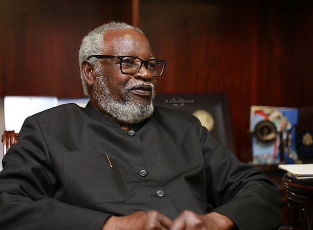
.caption[Hon. Sam Nujoma
]
]

---

# The .blue[National Marine Aquarium]

.left-column[

- **Planned & constructed by Namibians**

]

.right-column[

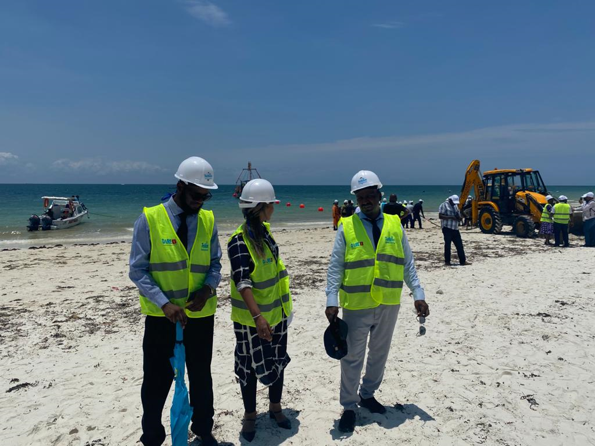
.caption[Coastal construction
]

]


---

name: activities

# Several activities at .blue[aquarium]


---

template: activities

.pull-left[

## Education

- Visiting groups
   - Presentations
   - Floor tours
   - Discuss Namibian .blue[marine life & Aquarium system]

]

.pull-right[


.caption[Visiting school group
]
]

---

template: activities

.pull-left[

## Research

- Sizing activities
   - Determine .blue[growth rates]
- Monitor behaviour 
   - Called .blue[ethology]

]

.pull-right[


.caption[Measuring Galjoen length
]
]

---

template: activities

.pull-left[

## Conservation

- Rescue and .blue[rehabilitation] center
   - Care for .blue[ill, injured or stranded] marine animals
]

.pull-right[

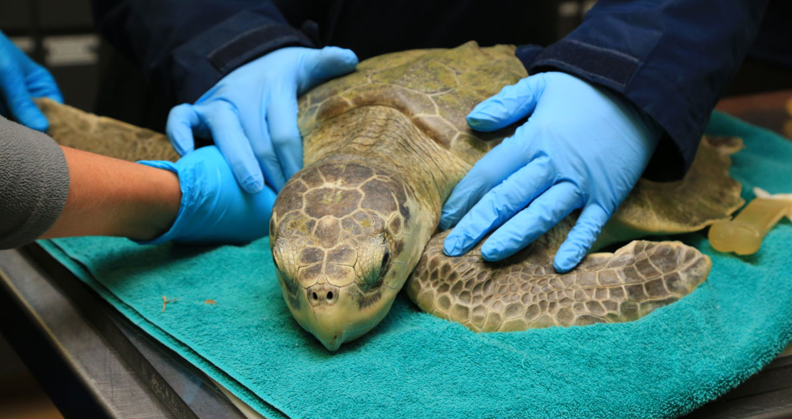
.caption[Treating injured sea turtle
]
]


---

name: interior

background-image: url("images/main_tunnel.gif")
background-size: cover


# Inside the .blue[Aquarium]

.itl-orange[
**Two main sections**
]

--

background-image: url("")
background-size: cover

.panelset[
.panel[.panel-name[Main tank]
.pull-left[

.caption[
Tunnel section
]
]
.pull-right[
- Majority of .blue[large fish] species
- .blue[4.5m] deep
- .blue[320 000 liters] sea water
- 10cm thick acrylic glass display panels
]
]


.panel[.panel-name[Small tanks]

.pull-left[

.caption[
Intertidal display section
]
]
.pull-right[
- 17 tanks
- Mostly .blue[smaller intertidal] species
]
]
]

---


name: system

background-image: url("images/pier.png")
background-size: cover


# How does the .blue[Aquarium] work??

.itl-orange[
**Sea water transport**
]

--

background-image: url("")
background-size: cover

.panelset[
.panel[.panel-name[Water intake]
.pull-left[
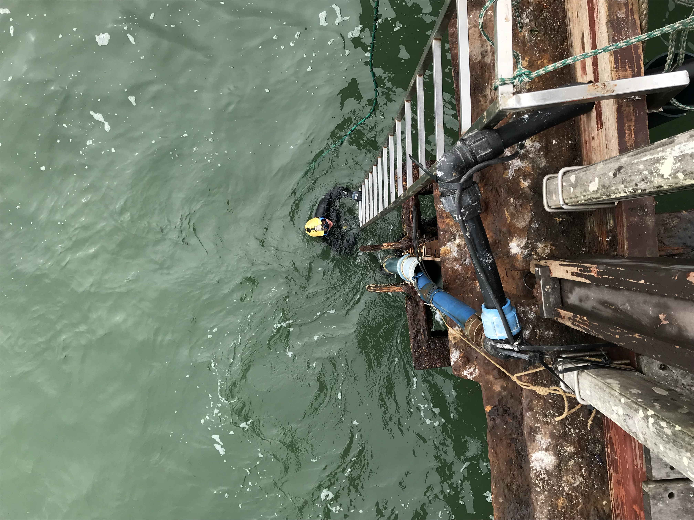
.caption[
Submersible water pump
]
]
.pull-right[
- Pump held .blue[under] the sea surface
- Takes in .blue[sea] water
- 1 liter per second
]
]


.panel[.panel-name[Transport system]


.pull-left[
```{r out.width='100%', fig.height=6, eval=require('leaflet'), echo=FALSE}
#read in world borders shape file
world_border <- read_sf(paste("C:/Users/Sebbi Kankondi/Desktop/Academic/PhD/Write_Ups",
                              "/MHA_MHU/data/mapshapes",
                              "/world_borders/TM_WORLD_BORDERS-0.3.shp", sep=""))

#read in the MFMR facilities coordinates
#convert multiple variables to numeric or factor
mfmr_coords <- read_excel("data/institute_location.xlsx") %>% 
    mutate_at(c("long","lat"), as.numeric) %>% 
    mutate_at(c("region","town","institute","institute_type"), as.character)  
  # st_as_sf(coords = c("lat","long"), crs = 4326)

#create new label variable for mfmr_coords that contains multiple
#values pasted together

##need to create them as an html tag and then mark them as html so
##that it can be rendered into the map as an html tag
mfmr_coords$label <- paste("<p>", mfmr_coords$institute, "<p/>",
                           "<p>", mfmr_coords$institute_type, "<p/>",
                           "<p>", mfmr_coords$town, "<p/>")


leaflet() %>% 
  addTiles() %>% 
  addProviderTiles(providers$Esri.WorldImagery) %>% 
  setView(14.52294, -22.6854, zoom = 15) %>% 
  addCircleMarkers(lng = mfmr_coords$long, lat = mfmr_coords$lat,
                   color = "#FF4500", radius = 3, opacity = 1,
                   label = lapply(mfmr_coords$label, HTML)) #tag as HTML

```
.caption[
Underground plumbing 
]
]

.pull-right[
- Pipes .blue[under] jetty floor boards & pavement
- Transports water into aquarium
]
]
]


---


name: system2

background-image: url("images/jetty_sunset.jpg")
background-size: cover


# How does the .blue[Aquarium] work??

.itl-orange[
**Sea water filtration**
]

--

background-image: url("")
background-size: cover

.panelset[


.panel[.panel-name[Mechanical filtration]

.pull-left[

.caption[
Fractionator, Flocculation & DAF unit
]
]
.pull-right[
- 1st port of .blue[water entry] into building
- DAF = Dissolved Air Flotation
- Works with .blue[flocculation] process
- .blue[Removes] suspended solids e.g., phytoplankton
]
]


.panel[.panel-name[Flocculation]

.pull-left[
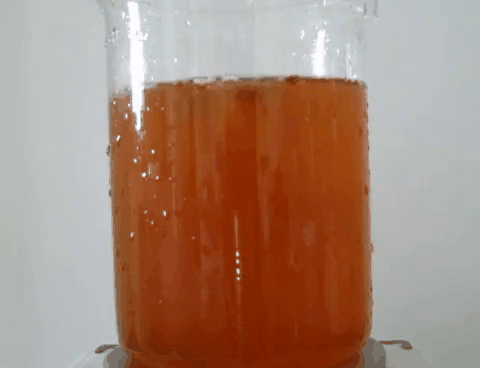
.caption[
Flocculation process
]
]
.pull-right[
- Suspended solid material .blue[coagulated] (small lumps form bigger lumps)
- Dissolved .blue[air surrounds] coagulated material
- Coagulated material .blue[floats]
- .blue[Skimmed] off the top as waste
- Also removed at .blue[bottom] as sludge
- Partially cleaned water transported .blue[to filter tanks]

]
]


.panel[.panel-name[Chemical filtration]

.pull-left[
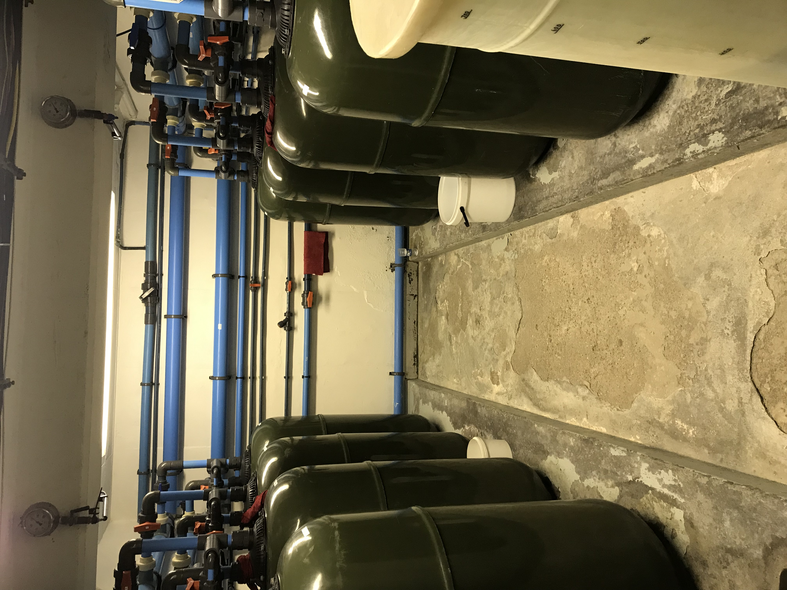
.caption[
Filter tanks
]
]
.pull-right[
- Water passed through filter tanks
   - Contains activated filter media
- Removes unwanted solids & impurities
]
]

.panel[.panel-name[Activated filter media]

.pull-left[

.caption[
Cross section of filtration process
]
]
.pull-right[
- Also called activated charcoal/carbon
- Removes .blue[micropollutants] through adsorption
   - Unwanted dissolved molecules .blue[attach] to surface of filter media
   - e.g., chemicals, medications, heavy metals
- .blue[Clean] water transported to main and small tanks

]
]


.panel[.panel-name[Biological filtration]

.pull-left[

.caption[
Aquarium gravel
]
]
.pull-right[
- Biological .blue[waste] collects in display tanks
   - Urea, fecal & decaying matter
- Increased .blue[toxic] compounds e.g., ammonia & nitrite
- Removed by .blue[bacteria in gravel] at bottom of main tank

]
]


.panel[.panel-name[Nitrifying bacteria]

.pull-left[

.caption[
Bacterial multiplication
]
]
.pull-right[
- Gravel provides .blue[large surface] area for nitrifying bacteria
- Bacteria breakdown toxic compounds into .blue[less toxic] nitrate
- Helps create .blue[safe], clean environment for aquatic animals

]
]


]


???

Add video describing flocculation

Add video describing chemical filtration
Add picture of main tank view from entrance.
Add video describing bio-filtration

---

name: sample-collection

background-image: url("images/intertidal.gif")
background-size: cover


# How are the .blue[marine animals] collected

--

background-image: url("")
background-size: cover

.panelset[

.panel[.panel-name[Intertidal sampling]

.pull-left[
 
.caption[
Drone footage of rocky intertidal near Luderitz
]
]
.pull-right[
- Collect small display animals from rocky shores
- .blue[Found in:]
   - Rock pools,
   - Under boulders
   - Rock caves/overhangs
]
]

.panel[.panel-name[Research vessel]
.pull-left[
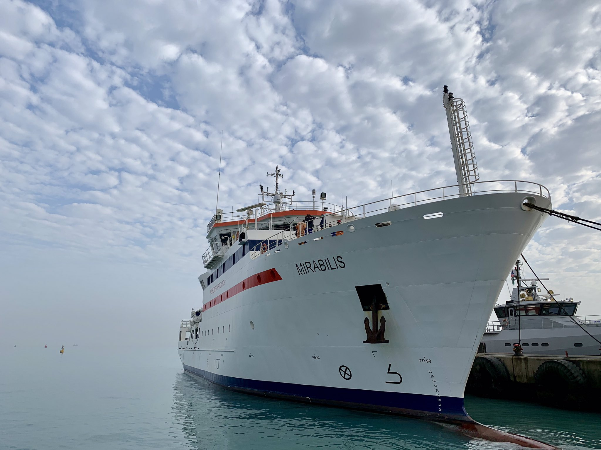
.caption[
Research vessel Mirabillis
]
]
.pull-right[
- Liaise with .blue[research vessel crew]
- .blue[Catch display animals] for the Aquarium
- .blue[Collected] from harbour 
]
]


.panel[.panel-name[Rod & reel]

.pull-left[
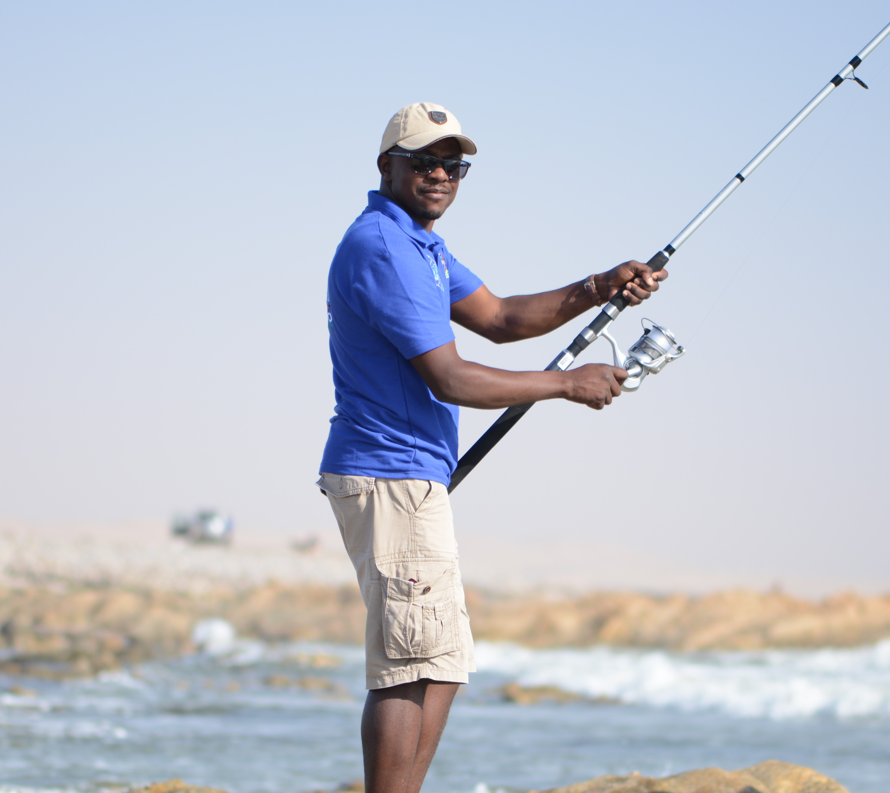 
.caption[
Volunteer fisherman
]
]
.pull-right[
- Arrange .blue[fishing trips] with .blue[expert anglers]
- A few times each year
- Catch .blue[many fish] in single trip
]
]


.panel[.panel-name[Diving]

.pull-left[
 
.caption[
Lobster diving
]
]
.pull-right[
- Several in .blue[house & volunteer] divers
- Scuba dive close to .blue[subtidal rocks]
   - Part of ocean .blue[where lobsters are found]
- Use .blue[specially designed] collection buckets
   - Easy in, hard out
]
]

]

---

name: sample-transport

background-image: url(https://pbs.twimg.com/media/D7Km39PXYAA3UGP?format=jpg&name=large)
background-size: cover


# .blue[Aquatic] life transport & preparation

.itl-orange[
**What's done to get the marine animals into the aquarium tanks??**
]

--

background-image: url("")
background-size: cover

.panelset[
.panel[.panel-name[Transit environment]
.pull-left[
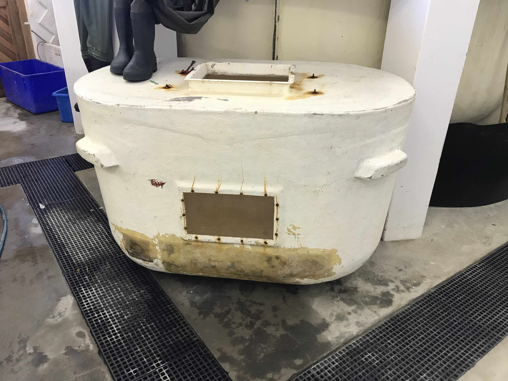
.caption[
Large 1000L collection tank
]
]
.pull-right[
- Fill tank with fresh .blue[seawater]
- Aerate tank with .blue[air stone]
- Place collected .blue[marine animals] in tank
]
]


.panel[.panel-name[Transport]

.pull-left[
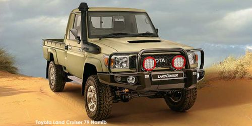 
.caption[
Toyota land cruiser
]
]
.pull-right[
- Collection tank .blue[kept in bakky] during sampling period
- .blue[Transported] to the aquarium .blue[immediately] after collection
]
]

.panel[.panel-name[Animal quarantine]

.pull-left[
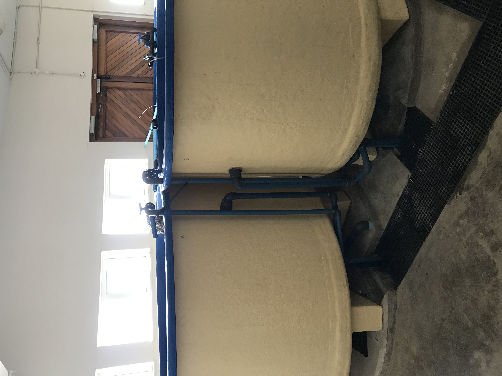 
.caption[
Quarantine tanks
]
]
.pull-right[
- Animals placed in .blue[quarantine before introduction] into Aquarium system
- Monitored for:
   - Any bacterial, viral or parasitic infections
   - General health status & condition
- .blue[Sick/dying] animals disposed
]
]


.panel[.panel-name[Specimen introduction]

.pull-left[
 
.caption[
Top of main tank
]
]
.pull-right[
- .blue[Healthy organisms] are thrown into the main tank .blue[from the top]
- Use .blue[appropriate] handling gear
   - scoop net
   - gloves
   - plastic trays
]
]

]

???
Take picture of sample tank or buckets inside the bakky
Take video of bakky in sample environment
Take video of quarantine tanks being filled up
Video of something being thrown into the main/small tanks


---

name: feeding

background-image: url("images/commercial_fisheries.gif")
background-size: cover


# How are the .blue[animals] fed

--

background-image: url("")
background-size: cover

.panelset[
.panel[.panel-name[Feed origin]
.pull-left[

.caption[
Simulated trawling 
]
]
.pull-right[
- Feed obtained from .blue[commercial] fisheries
   - Hake & squid
- Caught using large trawling vessels
]
]


.panel[.panel-name[feed storage]

.pull-left[
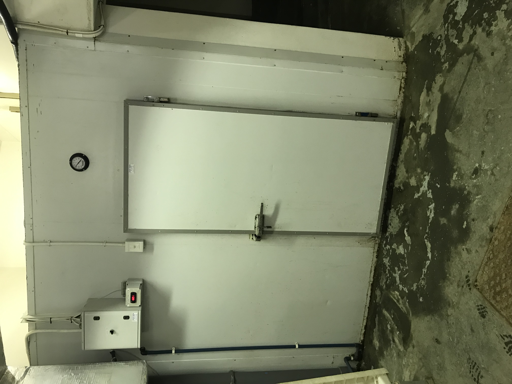 
.caption[
Freezer room
]
]
.pull-right[
- All feed kept in a large .blue[freezer room]
- .blue[Removed & thawed] when fish have to be fed
]
]

.panel[.panel-name[Feed preparation]

.pull-left[
 
.caption[
Technical assistants chopping up fish
]
]
.pull-right[
- Fish filleted, de-boned and chopped into .blue[small pieces]
- Different sizes for different size fish
- Not all display animals eat other fish
   - Some eat kelp, ulva, limpets, etc
]
]


.panel[.panel-name[Feeding]

.pull-left[
 
.caption[
Top of main tank
]
]
.pull-right[
- Feed thrown in .blue[from tops] of all tanks
- Diver hand feeds from inside main tank
- At 15:00 .blue[every] single day

]
]

]

???


---

name: display-animals

background-image: url("images/turtle.gif")
background-size: cover


# .blue[Aquatic] life inside Aquarium

--

background-image: url("")
background-size: cover

.panelset[
.panel[.panel-name[Sea turtle]

.pull-left[
 
.caption[
Green sea turtle
]
]
.pull-right[
- Highly migratory
   - Swims > 10,000km between nesting & breeding sites 
- Holds breath > 45 mins
   - Slows down heart rate
   - Slows down O<sub>2</sub>
]
]


.panel[.panel-name[Starfish]

.pull-left[
 
.caption[
Starfish feeding process
]
]
.pull-right[
- Found in intertidal rocks
- Hold food using tube feed under arms
- Push stomach out through mouth, and onto prey
- Digest prey on outside of body
]
]

.panel[.panel-name[Eagle ray]

.pull-left[
 
.caption[
Common eagle ray 
]
]
.pull-right[
- Common near bottom of ocean floor
- Digs up dirt with snout in search of food
- Feeds on molluscs & crustaceans
- Barbed sting at base of tail 
   - Self defense
]
]

.panel[.panel-name[South African Mullet]
.pull-left[
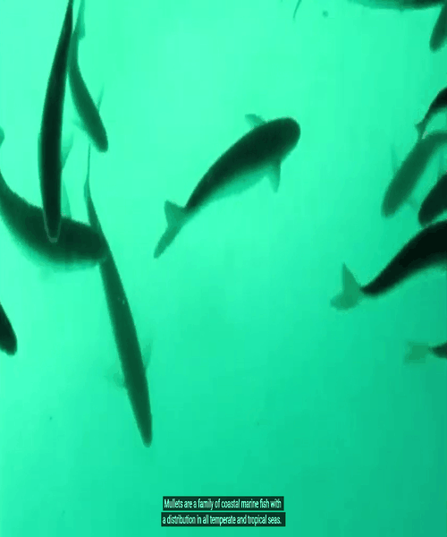
.caption[
Mullet school 
]
]
.pull-right[
- Most common fish
- Max length 30cm (ruler)
- Normally found near shore
   - Tidal pools, estuaries, etc
]
]


]

???

---

name: problems

background-image: url("images/river.gif")
background-size: cover


# Common .blue[problems] faced by Aquarium

--

background-image: url("")
background-size: cover


.panelset[
.panel[.panel-name[Murky water]

.pull-left[
 
.caption[
Drone footage Swakopmund river outflow
]
]
.pull-right[
- Increased debris & sediments in the water
- Reduced visibility of water in displays
- Increased strain on filtration system
]
]


.panel[.panel-name[Sulphur eruption]

.pull-left[
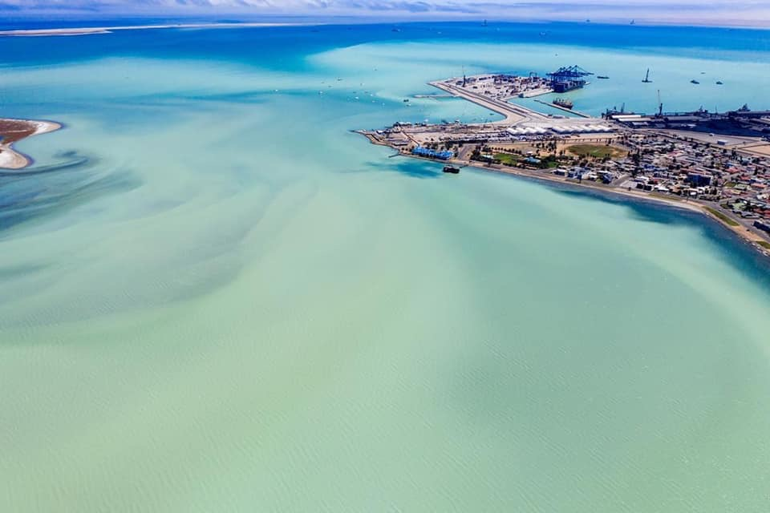 
.caption[
Sulphur eruption around Walvis Bay
]
]
.pull-right[
- Excess organic matter 
- Decays & accumulates on sea floor
- Creates hydrogen sulphide (H<sub>2</sub>S)
- Sulphur eruptions release H<sub>2</sub>S into water
   - Toxic to aquatic life (H<sub>2</sub>S poisoning)
]
]


.panel[.panel-name[Harmful algal bloom]

.pull-left[
 
.caption[
Microscope slide of algae cells 
]
]
.pull-right[
- Benguela upwelling increases nutrients in surface waters
- Algal cell proliferation
- Deplete water O<sub>2</sub> concentration
- Marine animals suffocate & die
]
]

]

???


---

class: inverse, center, middle

background-image: url("images/questions.gif")
background-size: cover

# Questions???


---

class: inverse, center, middle

# Thank You!


