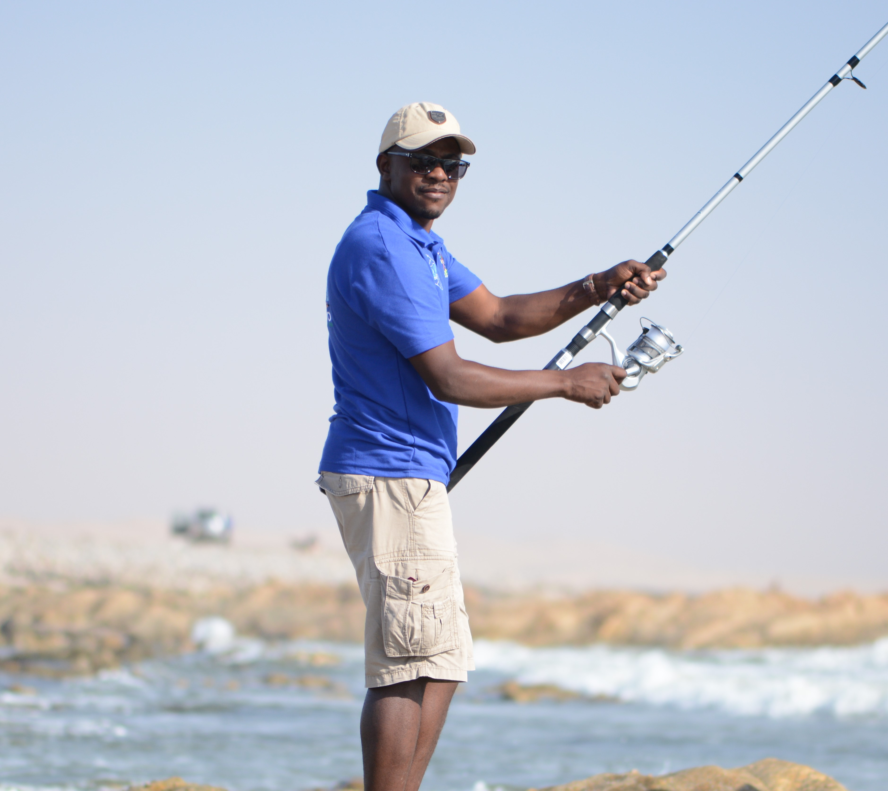

class: title-slide, top, left, inverse
background-image: url("images/aquarium_use.png")
background-size: cover

# **`r rmarkdown::metadata$title`**
## **`r rmarkdown::metadata$subtitle`**
### `r rmarkdown::metadata$author`
### **`r rmarkdown::metadata$institute`**
### `r Sys.Date()`

```{r setup, include=FALSE}
#load multiple libraries function location
source("C:/Users/Sebbi Kankondi/Desktop/Academic/PhD/Write_Ups/multiple_libraries.R")

# read_library <- function(...) {
#   obj <- eval(substitute(alist(...)))
#   #print(obj)
#   return(invisible(lapply(obj, function(x)library(toString(x), character.only=TRUE))))
# }


read_library(tidyverse, leaflet, sf, xaringanExtra,
             readxl, ggmap, htmltools, knitr)


options(htmltools.dir.version = FALSE)
```

```{r xaringan-tile-view, echo=FALSE}
xaringanExtra::use_tile_view()
```

```{r xaringan-panelset, echo=FALSE}
xaringanExtra::use_panelset()
```

---

# The .blue[National Marine Aquarium]

.left-column[

- **Opened in 1995**

]
.right-column[


.caption[Hon. Sam Nujoma
]
]

---

# The .blue[National Marine Aquarium]

.left-column[

- **Planned & constructed by Namibians**

]

.right-column[


.caption[Coastal construction
]

]


---

name: activities

# Several activities at .blue[aquarium]


---

template: activities

.pull-left[

## Education

- Visiting groups
   - Presentations
   - Floor tours
- Discuss Namibian .blue[marine life & Aquarium system]

]

.pull-right[


.caption[Visiting school group
]
]

---

template: activities

.pull-left[

## Research

- Animal sizing activities
   - How quickly do fish .blue[grow]?
- Check animal behaviour 

]

.pull-right[


.caption[Measuring Blacktail fish length
]
]

---

template: activities

.pull-left[

## Conservation

- Rescue & .blue[recovery] center
   - Care for .blue[ill, injured or stranded] marine animals
]

.pull-right[


.caption[Treating injured sea turtle
]
]


---

name: interior

background-image: url("images/main_tank.gif")
background-size: cover


# Inside the .blue[Aquarium]

.itl-orange[
**Two main sections**
]

--

background-image: url("")
background-size: cover

.panelset[
.panel[.panel-name[Main tank]
.pull-left[

.caption[
Tunnel section
]
]
.pull-right[
- Most of the .blue[large fish] in the Aquarium
- .blue[4.5m] deep
- .blue[320 000 liters] sea water
- 10cm thick glass display panels
]
]


.panel[.panel-name[Small tanks]

.pull-left[

.caption[
Intertidal display section
]
]
.pull-right[
- 17 tanks
- Mostly .blue[smaller intertidal] animal
- Intertidal
   - Area (5-20m stretch) of sea .blue[closest] to land
]
]
]

---


name: system

background-image: url("images/pier.png")
background-size: cover


# How does the .blue[Aquarium] work??

.itl-orange[
**Sea water transport**
]

--

background-image: url("")
background-size: cover

.panelset[
.panel[.panel-name[Water intake]
.pull-left[

.caption[
Underwater water pump
]
]
.pull-right[
- Pump held .blue[under] the sea surface
- Takes in .blue[sea] water
- 1 liter per second
]
]


.panel[.panel-name[Transport system]


.pull-left[
```{r out.width='100%', fig.height=5.5, eval=require('leaflet'), echo=FALSE}
#read in world borders shape file
world_border <- read_sf(paste("C:/Users/Sebbi Kankondi/Desktop/Academic/PhD/Write_Ups",
                              "/MHA_MHU/data/mapshapes",
                              "/world_borders/TM_WORLD_BORDERS-0.3.shp", sep=""))

#read in the MFMR facilities coordinates
#convert multiple variables to numeric or factor
mfmr_coords <- read_excel("data/institute_location.xlsx") %>% 
    mutate_at(c("long","lat"), as.numeric) %>% 
    mutate_at(c("region","town","institute","institute_type"), as.character)  
  # st_as_sf(coords = c("lat","long"), crs = 4326)

#create new label variable for mfmr_coords that contains multiple
#values pasted together

##need to create them as an html tag and then mark them as html so
##that it can be rendered into the map as an html tag
mfmr_coords$label <- paste("<p>", mfmr_coords$institute, "<p/>",
                           "<p>", mfmr_coords$institute_type, "<p/>",
                           "<p>", mfmr_coords$town, "<p/>")


leaflet() %>% 
  addTiles() %>% 
  addProviderTiles(providers$Esri.WorldImagery) %>% 
  setView(14.52294, -22.6854, zoom = 15) %>% 
  addCircleMarkers(lng = mfmr_coords$long, lat = mfmr_coords$lat,
                   color = "#FF4500", radius = 3, opacity = 1,
                   label = lapply(mfmr_coords$label, HTML)) #tag as HTML

```
.caption[
Clickable map of jetty to Aquarium path 
]
]

.pull-right[
- Pipes .blue[under] jetty floor & pavement
- Transports water into aquarium
]
]
]


---


name: system2

background-image: url("images/jetty_sunset.png")
background-size: cover


# How does the .blue[Aquarium] work??

.itl-orange[
**Sea water filtration**
]

--

background-image: url("")
background-size: cover

.panelset[


.panel[.panel-name[Mechanical filtration]

.pull-left[

.caption[
Mechanical filter tanks
]
]
.pull-right[
- 1st place .blue[water enters] building
- Suspended solids e.g., phytoplankton are .blue[removed] here
]
]


.panel[.panel-name[Chemical filtration]

.pull-left[

.caption[
Filter tanks
]
]
.pull-right[
- Water passed through filter tanks
   - Contains activated filter material 
- Removes unwanted solids & impurities
]
]


.panel[.panel-name[Biological filtration]

.pull-left[

.caption[
Aquarium gravel
]
]
.pull-right[
- Biological .blue[waste] collects in display tanks
   - Urea, fecal & rotting matter
- Increased .blue[toxic] material
- Removed by .blue[bacteria in gravel] at bottom of main tank

]
]


]


???
Mechanical filtration
- Physically remove unwanted particles
Foam fractionator works similarly to DAF


---

name: sample-collection

background-image: url("images/intertidal.gif")
background-size: cover


# How are the .blue[animals] collected???

--

background-image: url("")
background-size: cover

.panelset[

.panel[.panel-name[Intertidal collection]

.pull-left[
 
.caption[
Drone footage of rocky intertidal near Luderitz
]
]
.pull-right[
- Collect small display animals from rocky shores
- .blue[Found in:]
   - Rock pools,
   - Under rocks
   - Rock caves
]
]


.panel[.panel-name[Rod & reel]

.pull-left[
 
.caption[
Volunteer fisherman
]
]
.pull-right[
- Arrange .blue[fishing trips] with .blue[expert fishermen]
- A few times each year
- Catch .blue[many fish] in single trip
]
]


.panel[.panel-name[Diving]

.pull-left[
 
.caption[
Lobster diving
]
]
.pull-right[
- Mostly lobster diving
- Scuba dive close to .blue[subtidal rocks]
   - Part of ocean .blue[where lobsters are found]
- Use .blue[special] collection buckets
   - Hard for collected animals to escape
]
]

]

---

name: sample-transport

background-image: url(https://pbs.twimg.com/media/D7Km39PXYAA3UGP?format=jpg&name=large)
background-size: cover


# .blue[Display animal] transport & preparation

.itl-orange[
**What's done to get the marine animals into the aquarium tanks??**
]

--

background-image: url("")
background-size: cover

.panelset[
.panel[.panel-name[Collection tank]
.pull-left[

.caption[
Large 1000L collection tank
]
]
.pull-right[
- Fill tank with fresh .blue[seawater]
- Blow air bubbles into the water 
- Place collected .blue[marine animals] in tank
]
]


.panel[.panel-name[Transport]

.pull-left[
 
.caption[
Toyota land cruiser
]
]
.pull-right[
- Collection tank .blue[kept in bakky] during collection period
- .blue[Transported] to the aquarium .blue[right] after collection
]
]

.panel[.panel-name[Animal quarantine]

.pull-left[
 
.caption[
Quarantine tanks
]
]
.pull-right[
- Animals placed in .blue[quarantine] before being put in Aquarium
- Checked for:
   - Any bacterial, viral or parasitic infections
   - General health
- .blue[Sick/dying] animals removed
]
]


.panel[.panel-name[Animal introduction]

.pull-left[
 
.caption[
Top of main tank
]
]
.pull-right[
- .blue[Healthy organisms] are thrown into the main tank .blue[from the top]
- Use .blue[the correct] handling gear
   - scoop net
   - gloves
   - plastic trays
]
]

]


---

name: feeding

background-image: url("images/commercial_fisheries.gif")
background-size: cover


# How are the .blue[animals] fed???

--

background-image: url("")
background-size: cover

.panelset[
.panel[.panel-name[Feed origin]
.pull-left[

.caption[
Boat releasing fishing net 
]
]
.pull-right[
- Feed obtained from .blue[large fishing boats] 
   - Hake & squid
- Caught using large nets
]
]


.panel[.panel-name[feed storage]

.pull-left[
 
.caption[
Freezer room
]
]
.pull-right[
- Feed transported to Aquarium
- All feed kept in a large .blue[freezer room]
]
]

.panel[.panel-name[Feed preparation]

.pull-left[
 
.caption[
Technical assistant chopping up fish
]
]
.pull-right[
- .blue[Removed] from freezer & .blue[defrosted]
- Fish filleted, de-boned & chopped into .blue[small pieces]
- Different sizes for different size fish
- Not all display animals eat other fish
   - Some eat kelp, ulva etc
]
]


.panel[.panel-name[Feeding]

.pull-left[
 
.caption[
Diver hand feeding
]
]
.pull-right[
- Feed either
   - Thrown in .blue[from tops] of all tanks
- Or,
   - Diver hand feeds from inside main tank
- .blue[Every] single day at 15:00 

]
]

]

???


---

name: display-animals

background-image: url("images/turtle.gif")
background-size: cover


# .blue[Sea] life inside Aquarium

--

background-image: url("")
background-size: cover

.panelset[
.panel[.panel-name[Sea turtle]

.pull-left[
 
.caption[
Green sea turtle
]
]
.pull-right[
- Swims .blue[large] distances
   - Swims > 10,000km between feeding & breeding sites 
- .blue[Holds breath] > 90 mins
   - Slows down heart
   - Slows down oxygen use
]
]


.panel[.panel-name[Starfish]

.pull-left[
 
.caption[
Starfish feeding 
]
]
.pull-right[
- Found in intertidal rocks
- Special way of feeding 
   - Hold food using .blue[tube feet] under arms
   - Push .blue[stomach out] through mouth, & onto prey
   - Start digesting prey .blue[outside] of body
]
]

.panel[.panel-name[Eagle ray]

.pull-left[
 
.caption[
Common eagle ray 
]
]
.pull-right[
- Common near ocean floor
- Digs up dirt with "nose" in search of food
- Feeds on crabs, mussels, shrimp, etc
- .blue[Sting] found near body-tail connection point
   - Poisonous
   - Used in self defense
]
]


]

???

---

name: problems

background-image: url("images/river.gif")
background-size: cover


# Common .blue[problems] faced by Aquarium

--

background-image: url("")
background-size: cover


.panelset[
.panel[.panel-name[Dirty water]

.pull-left[
 
.caption[
Drone footage of Swakopmund river outflow
]
]
.pull-right[
- Heavy rainfall
- Swakopmund river flows into nearby ocean
- Increased .blue[dirt] in the water
- .blue[Reduced clarity] of water in displays
- Filtration system has to work .blue[harder]
]
]


.panel[.panel-name[Harmful algal bloom]

.pull-left[
 
.caption[
Microscope slide of algae cells 
]
]
.pull-right[
- .blue[Benguela upwelling] increases nutrients in water near the surface
- .blue[Rapid increase] in algae growth
- .blue[Increase] rotting organic matter
- .blue[Increase] bacterial activity. 
- .blue[Reduce] amount of oxygen in water
- Marine animals .blue[suffocate & die]
]
]

]

???


---

class: inverse, center, middle

background-image: url("images/questions.gif")
background-size: cover

# Questions???


---

class: inverse, center, middle

background-image: url("images/bye.gif")
background-size: cover

# Thank You!!


